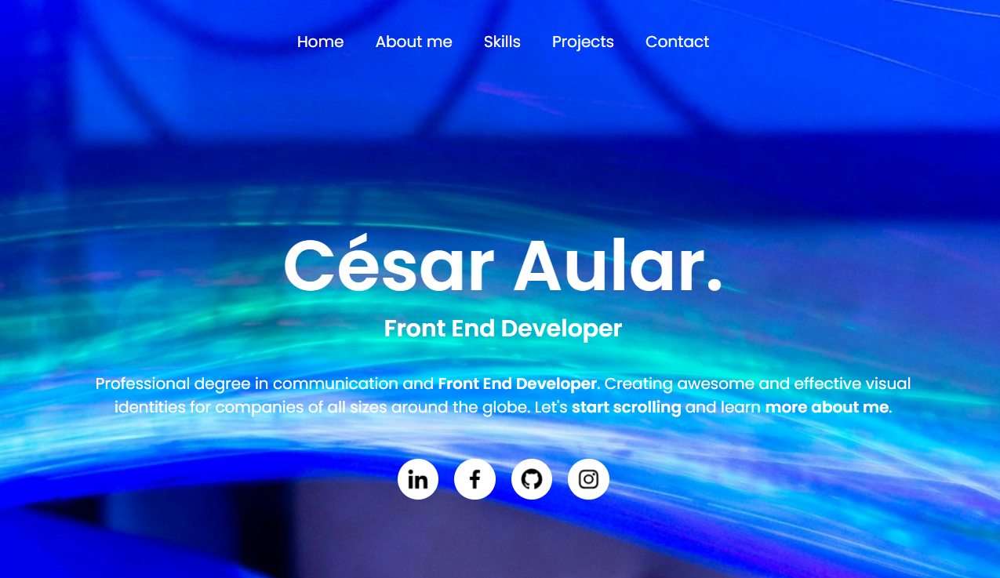

# Portfolio Web - César Aular

Este es mi portfolio personal como desarrollador web front end. Fue creado con HTML, CSS y JavaScript puro, con enfoque responsive para que funcione correctamente en distintos dispositivos.

## 🔍 Secciones del sitio

- **Home**: Presentación principal.
- **About me**: Breve descripción sobre mí, mi formación y objetivos.
- **Skills**: Tecnologías que manejo actualmente.
- **Projects**: Trabajos y proyectos personales.
- **Contact**: Íconos para acceder a redes sociales de contacto.

## 💻 Tecnologías utilizadas

- HTML5
- CSS3
- JavaScript
- Diseño responsive
- Flexbox

## 📱 Responsive Design

El sitio se adapta a pantallas de dispositivos móviles, tablets y escritorio. Utiliza media queries y ajustes en diseño para garantizar una buena experiencia de usuario.

## 📸 Captura de pantalla (opcional)

## 🚀 En desarrollo

Actualmente estoy construyendo y mejorando las secciones del portfolio. El proyecto se irá actualizando con nuevas funcionalidades y mejoras en el diseño.

---
